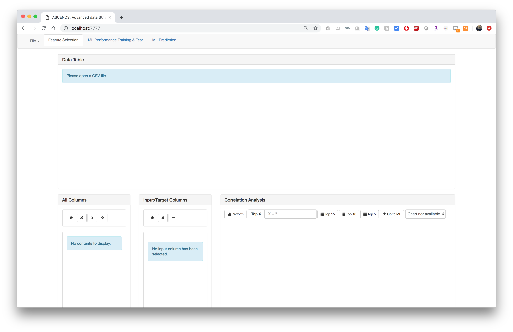
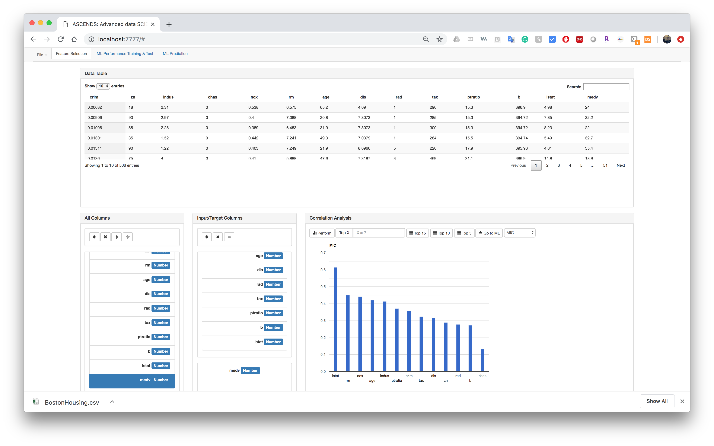
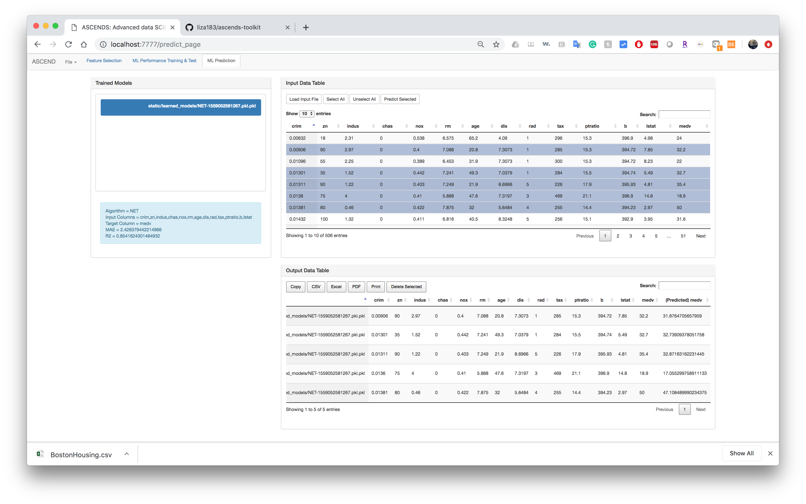

# ASCENDS: Advanced data SCiENce toolkit for Non-Data Scientists

# What is it for?

ASCENDS is a toolkit that is developed to assist scientists or any persons who want to use their data for machine learning.
We know that there are so many tools available for data scientists, but most of them require programming skills and often overwhelming.

We aim to provide a set of simple but powerful tools for non-data scientists to be able to intuitively perform various 
advanced data analysis and machine learning techniques with simple interfaces (**a command-line interface** and a web-based GUI).

The current version of ASCENDS mainly focuses on two different machine learning tasks - classification and regression (value prediction). 

* What is classification?
Users can train a predictive model (mapping function) that predicts a category (Y) from input variables (X) 
using ASCENDS. For instance, ASCENDS can train a model for predicting whether an email is spam or not-spam. 

* What is regression?
Users can train a predictive model that approximates a continuous output variable (y) from input variables (X) 
using ASCENDS. For instance, ASCENDS can train a model for predicting a value of house based on square footage, 
number of bedrooms, number of cars that can be parked in its garages, number of storages.

ASCENDS principles

- Supporting various classification/regression techniques (Linear regression, logistic regression, random forest, support vector machine, neural network, ...) 
- Supporting Feature selection based on various criteria
- Provides automatic hyperparameter tuning
- No programming skills required; but ASCENDS library can be used in your code if needed
- Using standard CSV (comma separated values) format data set 
- Built on top of open source projects (keras, tensorflow, scikit-learn, etc.)

Although ASCENDS has been originally developed for material scientists' research on high temperature alloy design,
the tool can be also used for many other applications.

# List of ORNL contributors
* Sangkeun Lee, Core Developer (lees4@ornl.gov, leesangkeun@gmail.com)
* Dongwon Shin, (shind@ornl.gov)
* Jian Peng (pengj@ornl.gov)
* Andrew Williams (Intern, 2019 Summer) (atw54@cornell.edu)

# Citation
We encourage you to cite both papers below, if you have used our tool:

[1]	S. Lee, J. Peng, A. Williams, D. Shin, ASCENDS: Advanced data science toolkit for non-data scientists, Journal of Open Source Software, 5 (2020) 1656. https://doi.org/10.21105/joss.01656.  
[2]	J. Peng, S. Lee, A. Williams, J.A. Haynes, D. Shin, Advanced data science toolkit for non-data scientists – A user guide, CALPHAD, 68 (2020) 101733. https://doi.org/10.1016/j.calphad.2019.101733.

The corresponding BibTex citations are as follows:  
```
@article{Lee2020,
  doi = {10.21105/joss.01656},
  url = {https://doi.org/10.21105/joss.01656},
  year = {2020},
  publisher = {The Open Journal},
  volume = {5},
  number = {46},
  pages = {1656},
  author = {Sangkeun Lee and Jian Peng and Andrew Williams and Dongwon Shin},
  title = {ASCENDS: Advanced data SCiENce toolkit for Non-Data Scientists},
  journal = {Journal of Open Source Software}
}
```
```
@article{PENG2020101733,
  doi = {https://doi.org/10.1016/j.calphad.2019.101733},
  url = {http://www.sciencedirect.com/science/article/pii/S0364591619302949},
  year = {2020},
  volume = {68},
  title = {Advanced data science toolkit for non-data scientists – A user guide},
  journal = {Calphad},
  issn = {0364-5916},
  publisher = {Elsevier}
}
```

# Publications with ASCENDS
ASCENDS has been used in the following research (last updated March 16, 2021):  
[1] J. Peng, R. Pillai, M. Romedenne, B.A. Pint, G. Muralidharan, J.A. Haynes, D.Shin, Data Analytics Approach to Predict High-Temperature Cyclic Oxidation Kinetics of NiCr-based Alloys, preprint, 2021, https://arxiv.org/abs/2102.13261.  
[2] J. Peng, Y. Yamamoto, M.P. Brady, S. Lee, J.A. Haynes, D. Shin, Uncertainty Quantification of Machine Learning Predicted Creep Property of Alumina-Forming Austenitic Alloys, JOM, 73 (2021) 164–173. https://doi.org/10.1007/s11837-020-04423-x.  
[3] J. Peng, Y. Yamamoto, J.A. Hawk, E. Lara-Curzio, D. Shin, Coupling physics in machine learning to predict properties of high-temperatures alloys, npj computational materials, 6 (2020) 141. https://doi.org/10.1038/s41524-020-00407-2.  
[4] J. Park, S. Jamil, A. Khan, S. Lee, Y. Kim, SCALEML: Machine Learning based Heap Memory Object Scaling Prediction,2020 9th Non-Volatile Memory Systems and Applications Symposium (NVMSA), Seoul, Korea (South), 2020, pp. 1-6, https://ieeexplore.ieee.org/abstract/document/9188162.  
[5] C. Do, W.R. Chen, S. Lee, Small Angle Scattering Data Analysis Assisted by Machine Learning Methods, MRS Advance, 5 (2020) 1577-1584. https://doi.org/10.1557/adv.2020.130.  
[6]	S. Lee, J. Peng, D. Shin, Y.S. Choi, Data analytics approach for melt-pool geometries in metal additive manufacturing, Science and Technology of Advanced Materials, 20 (2019) 972-978. https://doi.org/10.1080/14686996.2019.1671140.  


Earlier versions of ASCENDS have been used for the following research: 

[1] D. Shin, Y. Yamamoto, M.P. Brady, S. Lee, J.A. Haynes, Modern data analytics approach to predict creep of high-temperature alloys, Acta Materialia 168 (2019) 321-330. https://doi.org/10.1016/j.actamat.2019.02.017.  
[2] J. Wang  A. Y. Nobakht  J. D. Blanks  D. Shin  S. Lee,  A. Shyam, H. Rezayat,  S. Shin, Machine Learning for Thermal Transport Analysis of Aluminum Alloys with Precipitate Morphology, Adv. Theory Simul.(2019) 1800196. https://doi.org/10.1002/adts.201800196.  
[3]	J. Wang, S. Shin, S. Lee, Interatomic Potential Model Development: Finite-Temperature Dynamics Machine Learning, Adv. Theory Simul. (2019) 1900210. https://doi.org/10.1002/adts.201900210.   
[4] D. Shin, S. Lee, A. Shyam, A., J.A. Haynes, Petascale supercomputing to accelerate the design of high-temperature alloys, Sci. Technol. Adv. Mater, 18 (2017) 828–838. https://doi.org/10.1080/14686996.2017.1371559.  
     

We will be glad to list your publications here, if ASCENDS have been used in your work. Please report to Jian Peng (pengj@ornl.gov). Thank you very much.

# Installation (With Anaconda - For OSX/Linux)

ASCENDS requires Python version 3.X, and using Anaconda is recommended.
Please download Anaconda from https://www.anaconda.com/download/ and install first.

Once you installed Anaconda (with Python 3.X), clone the repository by doing 
``` 
git clone https://github.com/ornlpmcp/ASCENDS.git
```

Go to the ASCENDS directory and create a new Python environment for ascends by doing:
```
conda env create -f environment.yml --name ascends
```
Please refer to the environent.yml for dependencies.

To activate an environment:
- On Windows, in your Anaconda Prompt, run 
```
activate ascends
```
- On macOS and Linux, in your Terminal Window, run
```
conda activate ascends
```

You will see the active environment in parentheses at the beginning of your command prompt:
```
(ascends) $
```

Now you're ready to use ascends. Please see the next section for a quick start guide.
To check if you properly installed ascends-toolkit, run 
```
python train.py --help
```

If you see the usage help of regression trainer, you're ready to go.
Now have fun with ascends-toolkit.

To deactivate the current Anaconda environment, after using ascends.

- On Windows, in your Anaconda Prompt, run 
```
deactivate 
```
- On macOS and Linux, in your Terminal Window, run
```
conda deactivate
```
To make sure ascends-toolkit has been properly installed and lear how the tool can be used, please go over the following tutorials.

# Installation (with Windows 10 + Ubuntu Terminal)

First, install Ubuntu on Windows 10: https://www.microsoft.com/en-us/p/ubuntu/9nblggh4msv6?activetab=pivot:overviewtab
More detailed instruction is provided here: https://ubuntu.com/tutorials/ubuntu-on-windows#1-overview
Then, update and upgrade all the packages up-to-date by
```
$ sudo apt-get update $ sudo apt-get install
```
Next, install Anaconda on Windows 10 Ubuntu Terminal.
Detailed instruction can be found here: https://gist.github.com/kauffmanes/5e74916617f9993bc3479f401dfec7da
Once you successfully installed Anaconda on Windows 10 Ubuntu terminal, please follow the same procedure to install ASCENDS in MacOS/Linux.
   
Clone the repository by doing
```
git clone https://github.com/ornlpmcp/ASCENDS.git
```

Go to the ASCENDS directory and create a new Python environment for ascends by doing:
```
conda env create -f environment.yml --name ascends
```

Please refer to the environent.yml for dependencies.

To activate an environment in your Terminal Window, run
```
conda activate ascends
```

You will see the active environment in parentheses at the beginning of your command prompt:
```
(ascends) $
```

Now you're ready to use ascends. Please see the next section for a quick start guide. To check if you properly installed ascends-toolkit, run
```
python train.py --help
```

If you see the usage help of regression trainer, you're ready to go. Now have fun with ascends-toolkit.
To deactivate the current Anaconda environment, after using ascends in your Terminal Window, run
```
conda deactivate
```

To make sure ascends-toolkit has been properly installed and lear how the tool can be used, please go over the following tutorials.

# Installation (With Docker - For Windows, Experimental)

For Windows users, we made a Docker script for simple installation process.

Please install Docker Desktop for Windows from the following link: https://hub.docker.com/search?q=&type=edition&offering=community&sort=updated_at&order=desc
When installation is complete, open a terminal window, and go to Docker directory where Dockerfile is located:
```
cd Docker
```

Then run the following commands to build ASCENDS docker images
```
docker build . -t ascends
```

Then, run
```
docker run -it --volume={Your data directory}/:/data -p 7777:7777 ascends /bin/bash
```
to get inside the docker container. You need to specify your directory path to access data inside the container.
For instance, run 
```
docker run -it --volume=C:\Users\test\Desktop:/data -p 7777:7777 ascends /bin/bash
```

You will see a command line prompt.
```
(ascends) bash-4.2# 
```

Go to ASCENDS directory
```
cd ASCENDS
```
and run the following command to test if it is properly installed.
```
python train.py --help
``` 
Note that your data files will be located in /data within the container.
Please read regression/classification tutorial to learn how to use command-line interface.

To run GUI, please run
```
python ascends_server.py
```

Open a web-browser window and go to url: http://localhost:7777 then you will see the following:


Please read later sections to learn how to use the GUI for ASCENDS.

# Getting Started: Classification

To train your first model, we are going to use the Iris data set, which is one of the classic datasets introduced by the British statistician and biologist Ronald Fisher in his 1936 paper. 
Download the iris.csv into your data directory. (Save as the following link)

Link: https://raw.githubusercontent.com/pandas-dev/pandas/master/pandas/tests/data/iris.csv

The Iris data set consists of 50 samples from each of 3 species of Iris (Iris setosa, Iris virginica and Iris versicolor). 
Four features were measured from each sample: the length and the width of the sepals and petals, in centimeters.
Using ASCENDS, we will train a model that can predict a species of Iris, when new input data is given.

ASCENDS uses standard CSV (Comma Separated Values) file format,
and the file requires to have a header in the first line. The following shows the first 5 lines of the Iris data set.

```
SepalLength,SepalWidth,PetalLength,PetalWidth,Name
5.1,3.5,1.4,0.2,Iris-setosa
4.9,3.0,1.4,0.2,Iris-setosa
4.7,3.2,1.3,0.2,Iris-setosa
4.6,3.1,1.5,0.2,Iris-setosa
```
Let's try to train a classification model by executing the following command to train a classification model using ASCENDS:

```python train.py c data/iris.csv output/iris_project Name --mapping "{'Name': {'Iris-setosa':0, 'Iris-versicolor':1, 'Iris-virginica':2}}" --num_of_class 3```

`c` chooses a classification model. `data/iris.csv` refers to the file we just downloaded and placed in the data folder. 
`output/iris_project` specifies the location of the project folder we want to save our test and prediction sessions to.
ASCENDS will automatically create this directory and populate it accordingly.
`Name` is the target column name. So, ASCENDS will train a model that predicts `Name` when four other column (SepalLength,SepalWidth,PetalLength,PetalWidth) 
values are given. As we can see in the first 5 lines of data file, values for the column `Name` are not numerical. For training, we need to map
the categorical values into numerical values. This is done by using `--mapping` option. The example command will map `Iris-setosa` to 0, `Iris-versicolor` to 1, and `Iris-virginica` to 2
 for all values of column `Name`.

Then you will see, the following result.

```
$     python train.py c data/iris.csv output/iris_project Name --mapping "{'Name': {'Iris-setosa':0, 'Iris-versicolor':1, 'Iris-virginica':2}}" --num_of_class 3
Using TensorFlow backend.

 * ASCENDS: Advanced data SCiENce toolkit for Non-Data Scientists 
 * ML model trainer 

 programmed by Matt Sangkeun Lee (lees4@ornl.gov) 

 [ Data Loading ]
 Loading data from :data/iris.csv
 Columns to ignore :None
 Input columns :['SepalLength' 'SepalWidth' 'PetalLength' 'PetalWidth']
 Target column :Name
 Using default scikit-learn hyperparameters 
 Overriding parameters from command-line arguments ..

 [ Model Evaluation ]

* Classification Report
              precision    recall  f1-score   support

         0.0       1.00      1.00      1.00        50
         1.0       0.92      0.94      0.93        50
         2.0       0.94      0.92      0.93        50

    accuracy                           0.95       150
   macro avg       0.95      0.95      0.95       150
weighted avg       0.95      0.95      0.95       150

* Confusion Matrix (See here: http://bit.ly/2WxfXTy)
[[50  0  0]
 [ 0 47  3]
 [ 0  4 46]]

 Saving metadata to output/iris_project/metadata.csv
 Saving hyperparameters to file:  output/iris_project/parameters/session1c_iris_RF.tuned.prop

 [ Model Save ]
* Training initiated ..
* Training done.
* Trained model saved to file: output/iris_project/models/session1c_iris_RF.pkl

 Accuracy: 0.9533333333333334
```

When training is done, ASCENDS shows an expected accuracy that is calculated via 5-fold cross validation.
The result says that expected accuracy is 95.3% (not bad!). The trained model is saved as a file (~.pkl).
Information about the training session (arguments used and model performance) are saved in `output/iris_proj/metadata.csv`
So, now let's see how the trained model file can be used for classification 
with unknown (data that has not been used for training) input data. 

(Note: the accuracy can slightly differ because the tool randomly shuffle the data set when creating folds and we used a 'Random' Forest model.)

Copy the following text into a new file and save it to `data/iris_test_input.csv`.

```
SepalLength,SepalWidth,PetalLength,PetalWidth
7.2,2.5,4.1,1.3
5.2,5.5,4.1,1.3
```

As we can see above, we don't know the name of each flower. Let's run the following:

```
$ python predict.py c output/iris_project/models/session1c_iris_RF.pkl data/iris_test_input.csv output/iris_project --mapping "{'Name': {'Iris-setosa':0, 'Iris-versicolor':1, 'Iris-virginica':2}}"
```

Executing the above command will predict category (`c`) using model `output/iris_project/models/session1c_iris_RF.pkl` for the input data `data\iris_test_input.csv` and result will be saved in `output/iris_test_prediction.csv`.
Note that we specified the trained model file we achieved ealier via ```train.py``` command.

When you open up the generated output file `output/iris_project/predictions/session1c_iris_RF_predicted.csv`,
```
,SepalLength,SepalWidth,PetalLength,PetalWidth,Name
0,7.2,2.5,4.1,1.3,Iris-versicolor
1,5.2,5.5,4.1,1.3,Iris-versicolor
```
We can see that the model thanks that both are Iris-versicolor.

# Getting Started: Regression

Let's have some fun with regression. We are going to use Boston Housing Data. Download the file from following link and save in `data/BostonHousing.csv`.
Link: https://raw.githubusercontent.com/selva86/datasets/master/BostonHousing.csv

The data was drawn from the Boston Standard Metropolitan Statistical Area (SMSA) in 1970. 
The attributes are defined as follows (taken from the UCI Machine Learning Repository):
- crim: per capita crime rate by town 
- zn: proportion of residential land zoned for lots over 25,000 sq.ft. 
- indus: proportion of non-retail business acres per town 
- chas: Charles River dummy variable (= 1 if tract bounds river; 0 otherwise) 
- nox: nitric oxides concentration (parts per 10 million) 
- rm: average number of rooms per dwelling 
- age: proportion of owner-occupied units built prior to 1940 
- dis: weighted distances to five Boston employment centers 
- rad: index of accessibility to radial highways 
- tax: full-value property-tax rate per $10,000 
- ptratio: pupil-teacher ratio by town 
- b: 1000(Bk−0.63)2 where Bk is the proportion of blacks by town 
- lstat: % lower status of the population 
- medv: Median value of owner-occupied homes in $1000s

The following shows how to train a regression model using ASCENDS to predict `medv`.

```
$ python train.py r data/BostonHousing.csv output/boston_proj medv
Using TensorFlow backend.

 * ASCENDS: Advanced data SCiENce toolkit for Non-Data Scientists 
 * ML model trainer 

 programmed by Matt Sangkeun Lee (lees4@ornl.gov) 

 [ Data Loading ]
 Loading data from :data/BostonHousing.csv
 Columns to ignore :None
 Input columns :['crim' 'zn' 'indus' 'chas' 'nox' 'rm' 'age' 'dis' 'rad' 'tax' 'ptratio'
 'b' 'lstat']
 Target column :medv
 Using default scikit-learn hyperparameters 
 Overriding parameters from command-line arguments ..

 [ Model Evaluation ]
 Saving metadata to output/boston_proj/metadata.csv
 Saving test charts to :  output/boston_proj/graphs/session1r_BostonHousing_RF.png
 Saving hyperparameters to file:  output/boston_proj/parameters/session1r_BostonHousing_RF.tuned.prop

 [ Model Save ]
* Training initiated ..
* Training done.
* Trained model saved to file: output/boston_proj/models/session1r_BostonHousing_RF.pkl

 MAE: 2.2939071201712715 R2: 0.8461687142113155
```
Expected MAE (Mean Absolute Error) is 2.271 and R2 (https://bit.ly/2pP83Eb) is 0.857.

Copy the following text into a new file and save it to `data/BostonHousing_test_input.csv`.

```
crim,zn,indus,chas,nox,rm,age,dis,rad,tax,ptratio,b,lstat
0.00532,15,1.31,"0",0.538,5.575,62.1,4.09,1,296,15.3,396.9,4.98
0.02231,0,7.07,"0",0.469,5.421,78.9,3.9671,2,242,14.8,396.9,8.14
```

Similar to classification example, let's run the following:

```python predict.py r output/boston_proj/models/session1r_BostonHousing_RF.pkl data/BostonHousing_test_input.csv output/boston_proj```

(Note: the accuracy can slightly differ because the tool randomly shuffle the data set when creating folds and we used a 'Random' Forest model.)

Executing the above command will predict values (`r`) using model `output/boston_proj/models/session1r_BostonHousing_RF.pkl` for the input data `data/BostonHousing_test_input.csv` 
and resulting predictions will be saved in the `output/boston_proj` project folder.
Note that we specified the trained model file we achieved ealier via ```train.py``` command.

# Using Web-based GUI: Regression

The current version of ascends-toolkit provides a web-based GUI (graphic user interface) for regression tasks. To start the ascends-server, you need to download the source code from the repository. With ascends **Anaconda environment activated**, go to the ASCENDS directory. (If you run the ASCENDS server without activating the Anaconda environment with required packages installed, 
it will not run properly.)

Then, run the command as follows.

(ascends) slzmbpro:ascends-toolkit slz$ python ascends_server.py 
Using TensorFlow backend.

```
(ascends) $ python ascends_server.py 
 * ASCENDS: Advanced data SCiENce toolkit for Non-Data Scientists 
 * Web Server ver 0.1 

 programmed by Matt Sangkeun Lee (lees4@ornl.gov) 
 please go to : http://localhost:7777/
```

Open a web-browser window and go to url: http://localhost:7777 then you will see the following:


You can open a standard csv file by clicking File from the top-down menu and selecting a file. 



After a file was loaded, the 'All Columns' module allows you to choose what input and output variables for your model. You can perform correlation analysis between the selected input and output columns using the 'Correlation Analysis' module. Once you are ready to proceed, click 'Go to ML' button to move on the machine learning test module.


Within the ML tab, you can test various ML algorithms such as random forest, neural network, nearest neighbors, etc, and compare their accuracy. You can use either use a default hyper parameter setting or load a custom hyperparameter file for further optimization. For later prediction, you can save your trained model and it can be used later either with command-line interface or web-based GUI.


Prediction tab allows you to load a file (which must have the input columns that you used for training the model you selected) and predict target column values. You can export the prediction results in various formats including csv.

# Jupyter Notebook/API Reference/Testing

Ascends-toolkit is intended to be used via command-line interface or web-based interface; however, if needed,
users may still be able to use ascends-toolkit's APIs. The following shows an example of performing a regression task using 
the core ascends-toolkit APIs. Please see [API reference](api_reference.md) for more details.

Please take a look at the Jupyter notebook file (notebook/reference.ipynb) to understand the usage of ASCENDS APIs and test if installation was done properly.

# Community Guidelines
If you have a question or encounter a problem, we recommend you use GitHub's issue tracker. If you want to propose a change to the source code, please use a pull request.

# License

MIT License
Please contact us at lees4@ornl.gov (Matt Sangkeun Lee) for more details
